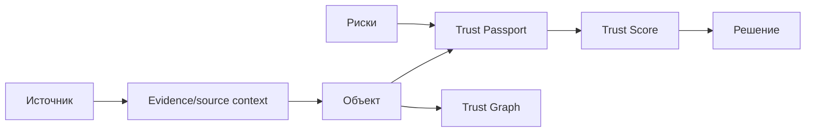

# 04. Основы ИБ и TrustOps

**Актив** — то, что имеет ценность: сервер, приложение, учётная запись. **Угроза** — возможная причина вреда. **Уязвимость** — слабость. **Риск** — сочетание сценария, вероятности и ущерба. **Контроль** — мера снижения риска.

**Цифровое доверие** не означает «объект абсолютно безопасен». Это обоснованная текущими данными степень уверенности, что объект соответствует ожиданиям безопасности и бизнеса.

**TrustOps** — операционный цикл: собрать факты, связать их с активами, оценить доверие, объяснить причины, назначить приоритет и отслеживать изменения.

В текущем MVP evidence представлен import metadata, а не независимой сущностью БД. Поэтому утверждение «Score полностью evidence-backed» является целевым направлением; фактически Score опирается на поля объекта, связанные риски, полноту и веса.

> Главное, что нужно запомнить: Trust Score помогает принять решение, но не заменяет эксперта, расследование или технический контроль.

## Проверь себя

1. Чем угроза отличается от уязвимости?
2. Почему доверие не равно отсутствию риска?
3. Что в текущем MVP является source context?

