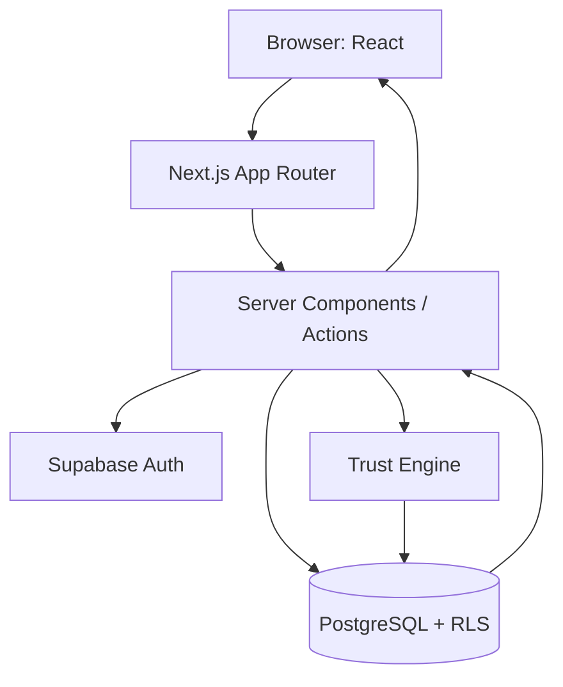
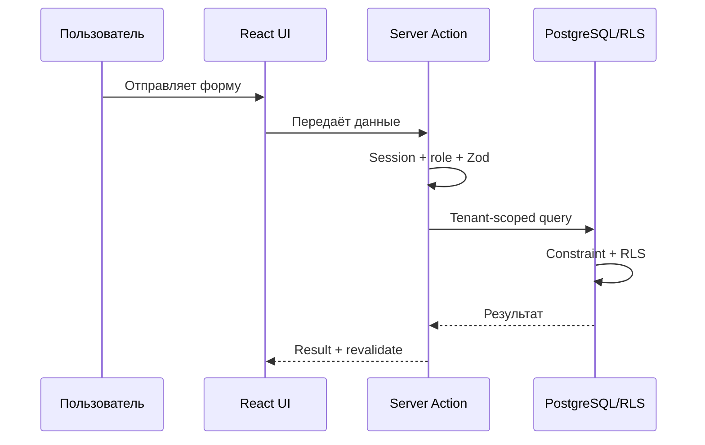

# 07. Архитектура системы

## Аналогия

Frontend — рабочее окно, Server Actions — сотрудники приёмной, PostgreSQL — архив, RLS — охрана у каждой полки, организация — отдельный кабинет клиента, audit — журнал действий.

## Техническая схема

Next.js выбран для UI и server-side операций в одном TypeScript-проекте. TypeScript уменьшает класс ошибок типов. Supabase даёт Auth, PostgreSQL и API, но не отменяет проектирование доступа. PostgreSQL обеспечивает связи, constraints, индексы и RLS.

## Движение запроса

Бизнес-логика находится в `lib/actions`, `lib/trust`, `lib/import`, `lib/reports`; browser input всегда недоверенный. Multi-tenancy обеспечивается совместно: server-side tenant scope плюс RLS.

Остальные диаграммы собраны в [diagrams/README.md](diagrams/README.md).

> Главное, что нужно запомнить: RLS — последний барьер, но приложение всё равно обязано проверять роль и tenant до запроса.

## Проверь себя

1. Почему нельзя доверять `organization_id` из формы?
2. Что делает Server Action?
3. Какую роль играет PostgreSQL помимо хранения?

