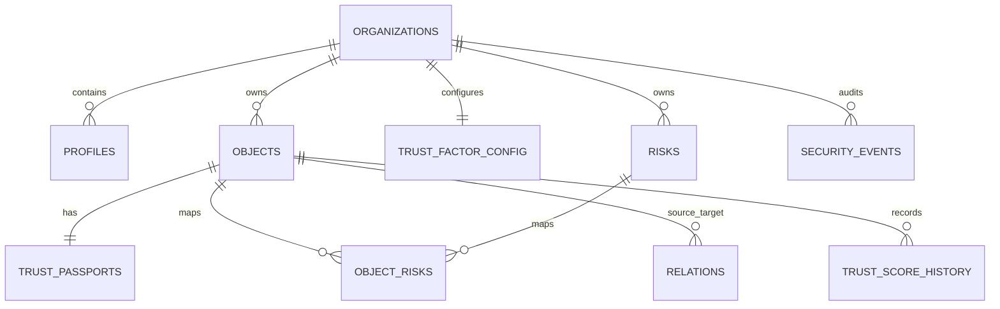

# 10. PostgreSQL и схема DTEK Core

## Термины

Таблица похожа на строгую электронную таблицу; строка — одна сущность; столбец — её свойство; тип запрещает неподходящие значения. Primary key уникально определяет строку, foreign key связывает таблицы, index ускоряет поиск, constraint запрещает некорректное состояние, transaction объединяет операции «всё или ничего», migration изменяет схему воспроизводимо, SQL описывает запрос.

## Фактические таблицы

| Таблица | Назначение и связи | Доступ |
|---|---|---|
| `profiles` | Пользователь, роль, tenant; FK к Auth и organization | Свой tenant; update self/owner |
| `organizations` | Tenant и агрегированный score | Участники tenant; owner меняет |
| `objects` | Активы; owner profile | Tenant read; owner/analyst/admin write, delete без admin |
| `trust_passports` | Один паспорт на object | Tenant read; системная запись |
| `trust_factor_config` | Один набор весов на tenant | Tenant read; owner/analyst update |
| `risks` | Риски, owner, сроки | Tenant read; role policies на write |
| `object_risks` | Many-to-many object ↔ risk | Tenant-scoped policies |
| `relations` | Directed graph edges | Tenant read; owner/analyst write |
| `trust_score_history` | Снимки расчётов | Tenant read; системная запись |
| `invitations` | Приглашения и токены | Ограниченный tenant access |
| `security_events` | Append-only audit | Owner/admin read; user insert denied |

Миграции `001–017` создают функции, таблицы, индексы, triggers, RLS hardening и audit. Cloud migration state требует отдельной сверки Supabase CLI. `types/database.ts` пока не содержит сгенерированные типы и является техническим долгом.

> Главное, что нужно запомнить: схема БД не только хранит данные — она запрещает неправильные значения и чужой tenant-доступ.

## Проверь себя

1. Зачем нужен foreign key?
2. Почему у паспорта `object_id` unique?
3. Какие таблицы пишет только система?
4. Что не подтверждено без Cloud migration list?

