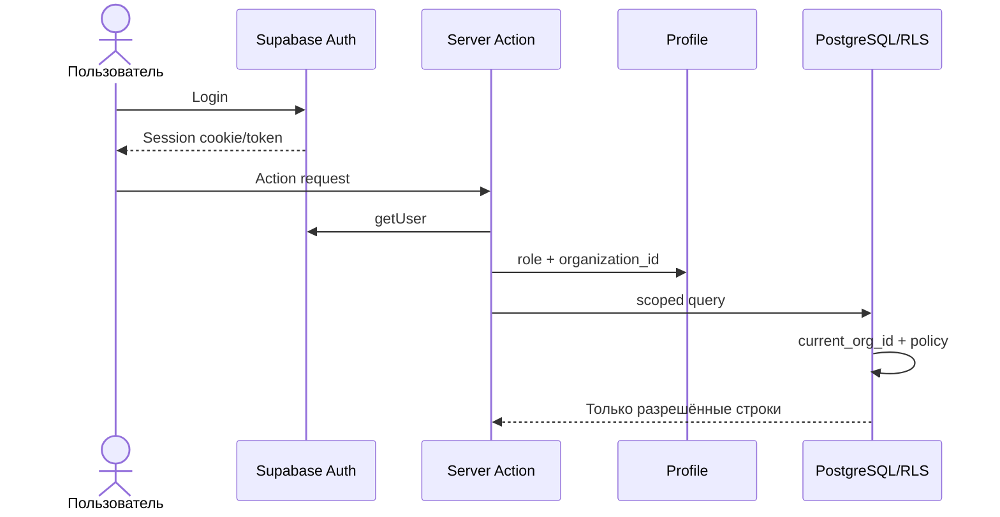
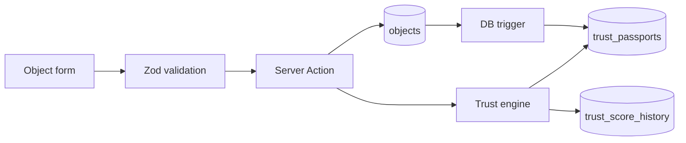
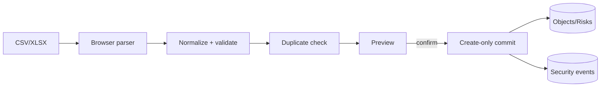
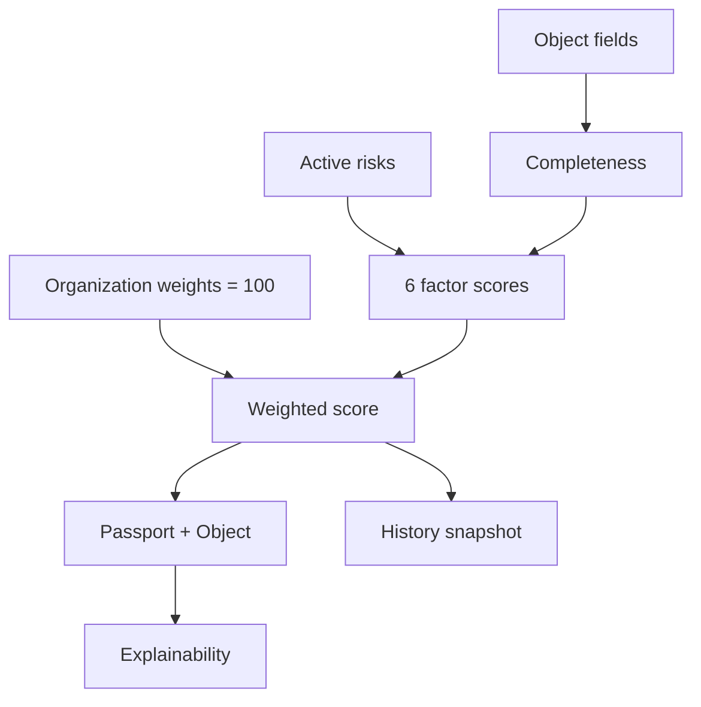
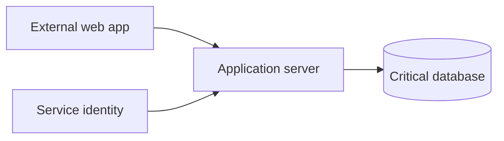
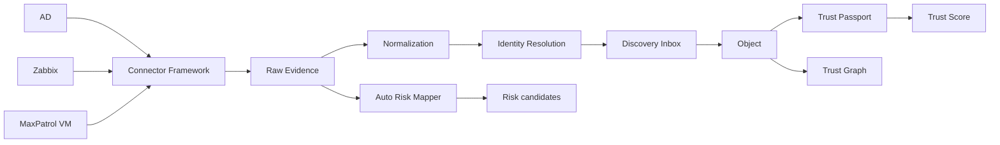

# Диаграммы DTEK Core

## Авторизация и tenant isolation

## Создание объекта

## Импорт

## Trust Score

## Trust Graph

Сейчас вершины — objects, рёбра — вручную созданные `relations`. Автоматическое извлечение рёбер отсутствует.

## Целевая evidence-first цепочка

Последняя диаграмма целевая: её блоки после import path ещё не являются работающим runtime.

